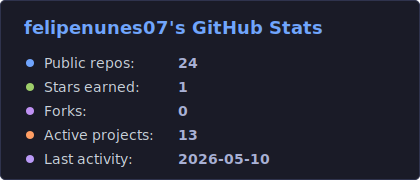
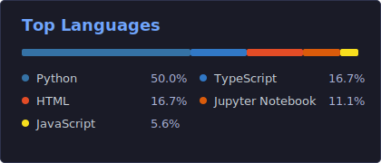

<h1 align="center">Felipe Arian</h1>

<p align="center">
  
  
  
</p>

<p align="center">
  I turn manual operations into intelligent systems: AI agents, automations, dashboards, CRMs, and web products connected to data and growth.
</p>

<p align="center">
  <a href="mailto:felipearian10197@gmail.com"></a>
  <a href="https://www.linkedin.com/in/felipearian/?locale=en" target="_blank"></a>
  <a href="https://www.instagram.com/felipearian7/" target="_blank"></a>
  <a href="https://wa.me/5511952960701" target="_blank"></a>
  <a href="https://github.com/felipenunes07?tab=repositories"></a>
</p>

---

### Stats

<div align="center">
  <a href="https://github.com/felipenunes07">
    
    
  </a>
</div>

---

### About me

I build AI-native systems with a business-first mindset, combining automation, data, product thinking, and growth execution to create tools that save time, reduce operational errors, and increase commercial speed.

- I design AI agents, pipelines, and LLM workflows with OCR, scraping, APIs, n8n, Make, Claude, Cursor, and Codex.
- I structure data for better decisions using Power BI, SQL, advanced Excel, KPIs, dashboards, exploratory analysis, and funnel metrics.
- I bring automation into marketing, sales, finance, and customer success with a focus on conversion, churn reduction, upsell, and efficiency.
- I build SaaS products and interfaces with TypeScript, React, Node.js, Python, Supabase, and relational databases.
- I like taking messy processes, understanding the business rules, and turning them into simple systems people can actually use.

### AI, agents & automation

<p align="center">
  
  
  
  
  
  
  
  
  
</p>

### Languages & tools

<p align="center">
  
</p>

<p align="center">
  
  
  
  
</p>

<hr>

### Focus areas

```txt
AI & Automation   Agents, LLMs, Cursor, Claude, Codex, n8n, Make, APIs
Data & BI         Power BI, SQL, advanced Excel, KPIs, dashboards, EDA
Growth & GTM      Funnels, segmentation, campaigns, conversion, churn, upsell
Web & SaaS        React, TypeScript, Node.js, Supabase, interfaces, and CRMs
```

### Featured projects

| Project | Area | Why it matters |
| --- | --- | --- |
| [CRM-XP](https://github.com/felipenunes07/CRM-XP) | SaaS / CRM / TypeScript | A system for organizing commercial operations, sales funnels, and customer relationships. |
| [wechat-ocr-auto](https://github.com/felipenunes07/wechat-ocr-auto) | Python / OCR / Automation | Automates reading and processing information from WeChat, reducing manual work. |
| [career-ops](https://github.com/felipenunes07/career-ops) | AI / Claude Code / Operations | An AI-powered job search system with PDF generation, work modes, and batch processing. |
| [orcamento-rapido-catalogo-xp](https://github.com/felipenunes07/orcamento-rapido-catalogo-xp) | TypeScript / Product / Sales | A tool to speed up catalogs and quotes, connecting product workflows with sales operations. |
| [conversor_olist_xp_main](https://github.com/felipenunes07/conversor_olist_xp_main) | Python / Data / Automation | Data conversion and treatment for operational and e-commerce workflows. |
| [Power-Bi](https://github.com/felipenunes07/Power-Bi) | BI / Dashboards / Analytics | Business intelligence work focused on indicators, visualization, and decision-making. |
| [Data-Science](https://github.com/felipenunes07/Data-Science) | Data Science / Notebooks | Experiments with analysis, statistics, and models to extract insights from data. |

---

<p align="center">
  
</p>
